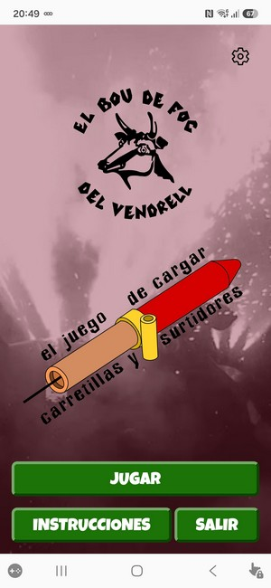
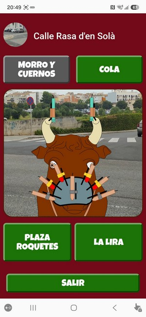
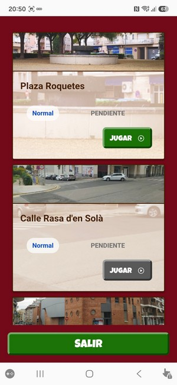
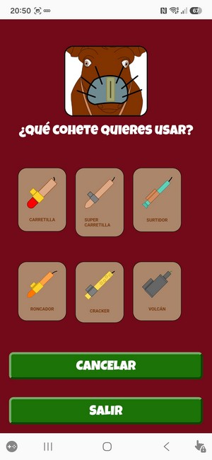
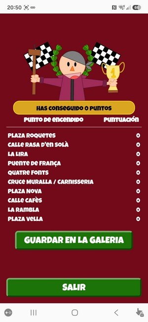

# El Bou de Foc del Vendrell

## El juego de cargar carretillas y surtidores

Juego de memoria realizado para la entidad El Bou de Foc del Vendrell ([Instagram del Bou](https://www.instagram.com/boudefoc_elvendrell/)).

Es un juego de memoria donde se han de recordar las combinaciones de carretillas y surtidores a usar en los diferentes puntos de encendido de la _Cercavila de Foc_ (acto de la fiesta major de El Vendrell) para, posteriormente, reproducirlas.

Se puede jugar en modo _real_, debiendo estar físicamente en cada lugar del recorrido de la _Cercavila de Foc_ para poder ir colocando las carretillas y surtidores al _Bou_, o de manera _virtual_, para poder jugar desde el sofá en casa.

## Imagenes

| Pantalla inicial | Carretillas y surtidores a recordar | Lista de puntos de encendido | Selector de carretillas y surtidores | Puntuaciones finales |
| --- | --- | --- | --- | --- |
|  |  |  |  |  |

***

Se ha usado Ionic y Angular

